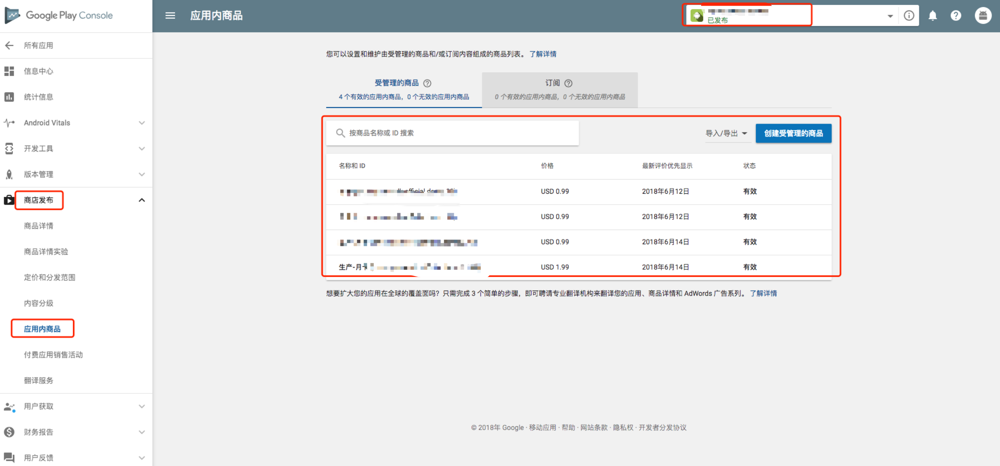
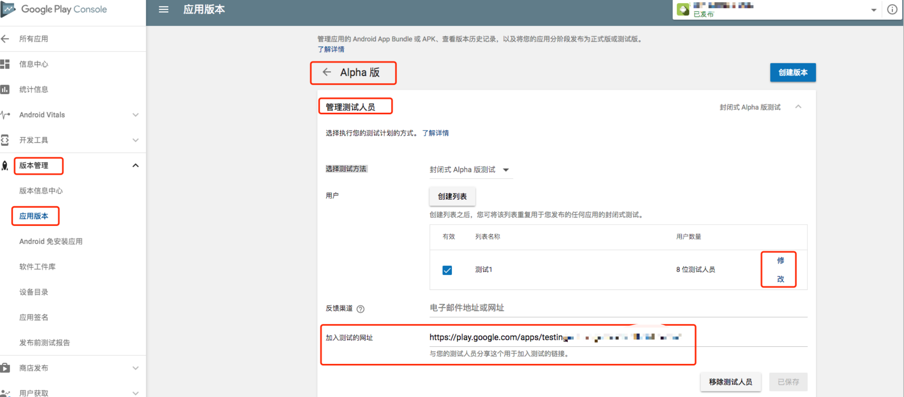
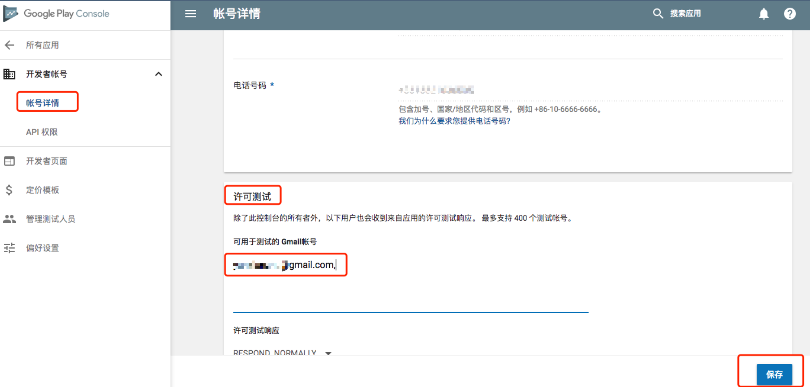

最近项目做海外版本，接入Google wallet支付后，测试验证比较繁琐，故记录一下。
Google wallet支付方式接入完成后，需要按照如下步骤设置，才可以进行支付测试：

## 一、配置并发布应用内商品

进入Google Play Console - 所有应用 ，选择具体应用，进行商品设置：



**注意：**

- 配置完应用内商品一定要发布，使之生效；
- 一定要保证网络环境所对应的国家在发布范围内；
- 游戏服务不支持商品配置，应用才支持商品信息设置；

## 二、上传APK并发布应用

Google Play Developer Console一个应用的发布渠道包括：正式渠道、Beta渠道、Alpha渠道，测试用的APK只要上传到Beta版或者Alpha版频道。

**注意：**

- 应用必须发布后，才可以测试支付功能。
- 应用发布后不会立即生效。
- 上传的APK包必须要有签名，而且不能用debug签名。
- 上传的APK包体积不能超过50M，否则需要做分包。
- apk包发布到Beta或者Alpha渠道即可，不需要发布到正式渠道。
- 如果应该状态变为【已发布】说明发布成功。
- Beta、Alpha也会进行严格审核，一些隐私问题或者政策问题会导致应用无法通过审核甚至下架。
- 安装到设备上用于测试的apk包可以和上传到Google Play的不同，但要保证这两个APK包使用相同的包名、签名、versionCode。
- 测试时使用的网络环境所属的国家和地区一定要在应用发布的国家或者地区范围内。

## 三、设置测试账号

（1）进入应用版本-具体发布渠道（如Alpha版）-管理测试人员，可以修改、添加测试人员账号；
（2）将【加入测试的网址】分享给测试人员访问，二次确认后才可以真正加入测试；

## 四、Android设备上安装应用

方法一：设备上GooglePlay直接搜索应用并安装；
方法二：通过PC的GooglePlay安装到指定手机；
方法三：若不使用GooglePlay应用，则传统apk安装即可，注意：与GooglePlay上的包保持相同的包名、签名、versionCode。

```undefined
安装到真机上的测试APP签名、包名和上传到Google Play的APK一致，就可以测试。  
```

## 五、Google Wallet支付

安装完成后，支付环节选择开发者后台配置的商品、Google Wallet支付方式即可，注意GooglePlay账号需要绑定支持国际支付的借记卡/信用卡，才可以支付成功。

## 六、沙盒测试

沙盒测试：测试期间，经过授权的用户帐户可通过 Google Play 购买您的应用内商品，不过这些用户帐户不用实际支付费用。

设置沙盒账号：在 Developer Console 中，转到 Settings > Account details，然后在 License Testing 部分将相应地址添加到 Gmail accounts with testing access 字段并保存。**划重点：**
1、沙盒测试的账号，也需要按照 一～五 的流程配置完成，才可以进行商品购买。
2、沙盒测试账号只是额外增加了许可测试（license test）的设置，支付时候不需要真正付款。

PS：Google开发者后台中文翻译迷之难理解，英文过关的建议直接查看英文版。
