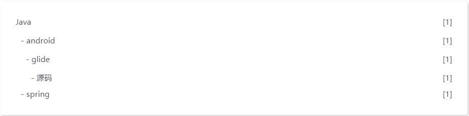

####  categories（分类）
```
## 在头部添加下面内容
categories: 
- [Java, android, glide, 源码] //这个为四级分类
- [Java, spring] //这个为二级分类
```
详细展示为（以keep主题为例）

#### tags（标签）
```
## 在头部添加下面内容
tags: [hexo, 教程] //这里添加了两个标签
```

#### links（友链）
```

```

#### about（关于）


#### 搜索功能
- 添加插件	在博客根目录执行命令

  ```
  npm install hexo-generator-searchdb --save
  ```

- 修改根目录下的`_config.yml`
    ```
    search:
      path: search.xml
      field: post
      format: html
      limit: 10000
      content: true
    ```

- 修改主题配置文件	我的路径：./themes/keep下的`_config.yml`文件

    ```
    local_search:
        enable: true
    ```

